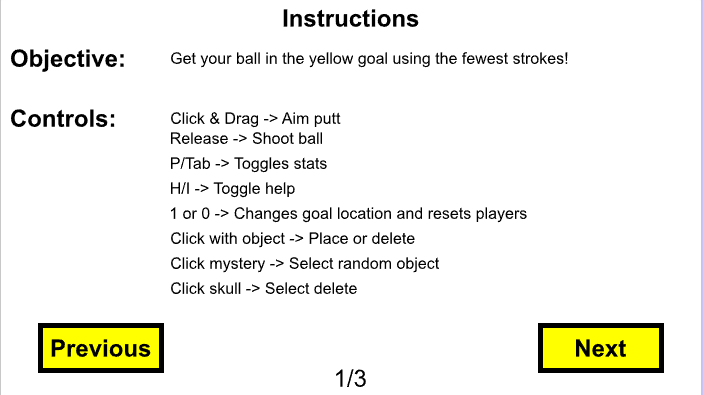
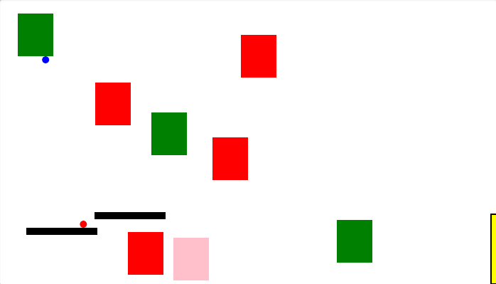
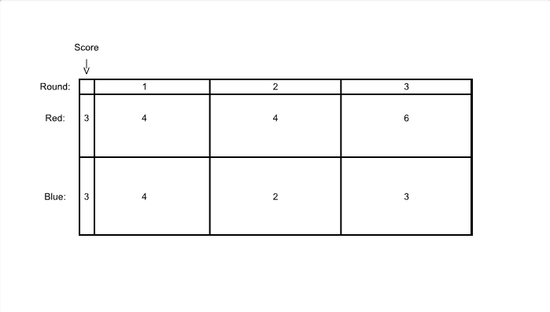

# 2D-Golf-Project
This is a 2D golf game created using Python in CMU's CS Academy. Players take turns hitting their balls toward a goal while using obstacles to make the course easier or more difficult.
[Play Golf Game](https://academy.cs.cmu.edu/sharing/midnightBlueAnt403754)

# Features
- Two-player turn-based gameplay.
- Mouse-controlled aiming and shot power.
- Physics-based ball movement.
- Collisions between players.
- Multiple obstacle types with different behaviors.
- Randomized mystery obstacles between rounds.

# Obstacles
The game features four different obstacle types:
- Death: Removes a player from the current round when touched.
- Bounce: Reverses and increases the player's velocity.
- Stick: Stops the player's movement when touched.
- Platform: Acts as a solid surface which allows players to phase in from below.

# Technologies
- Python
- CMU CS Academy

# Screenshots

.png)
.png)

.png)
.png)
.png)

# Reflection
During my time working on this project, I worked with heavy limitations from the platform I was using. Since the game was created in a course, I was only allowed to use what was taught prior to this project. I could, therefore, not make use of objects, classes, and many other programming concepts. This created many challenges I had to face, especially with the implementation of the obstacles. By deciding to implement the obstacles anyways, I challenged myself to find a way to optimize my code. I chose to shape all of the obstacles in my game as rectangles and store each obstacle type's corners into dictionaries. This is how I checked the player's position relative to every block in the game.

With the experiences I've gained now and by using a game engine such as Unity, I would be able to not only improve the obstacles, but also I would be able to change this game into a multiplayer game not limited to local settings. In addition, I'd also be able to stray away from turn based gameplay while keeping the comfortable mouse controls.
